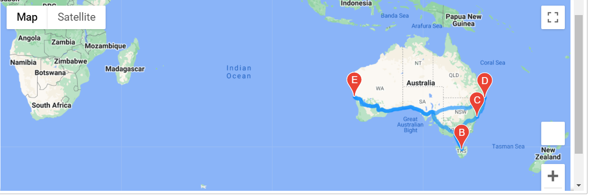
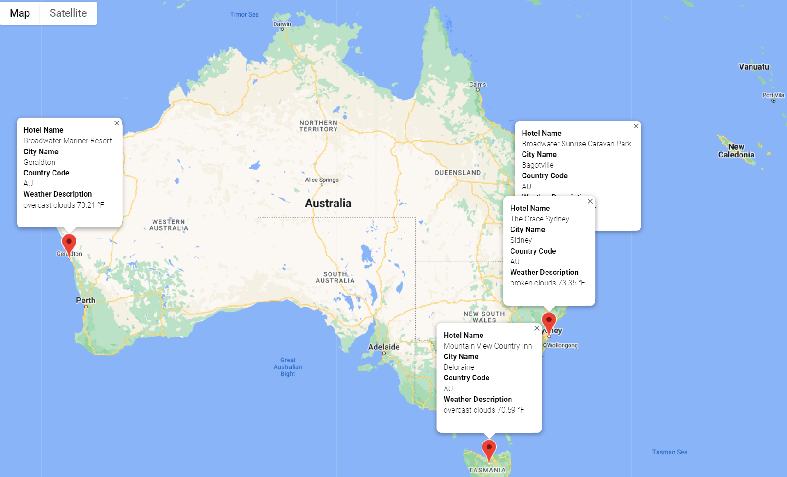

# World Weather & Vacation to Australia Analysis

## Overview of the World Weather & Vacation to Australia Analysis
The project was created to create scatter plots of the weather data and explore the Gmap's places and directions APIs
## Overview of Project
Using Python, NumPy, citipy, OpenWeatherMap APIs, Google Map APIs to generate more than 2,000 random latitudes and longitudes and able to select the favorite Vacation spots.
### Purpose
<b>To able Collect and analyze weather data across cities worldwide and to select the favorite Vacation spots.</b>
	
## Analysis and Challenges
Create a Pandas DataFrame with 800 or more of the world's unique cities and their weather data in real time took long awhile.  Also reseaching APIs requirement was very challenging. 

### Analysis of Outcomes 
It was quite a jouney, but ultimately met a goal where the world weather is analyzed, maps are drawn, and the vacation spots are marked by the user input.

- How might we provide real-time suggestions for our client's ideal hotels?
#### It might be fun to juggle around the user credetials to fiter the available spots around the world in a blink of an eye to sort the hotels that are nearby.  

The World map random selections by perfect tempoture

Here is an example of Australia South beach tour:

